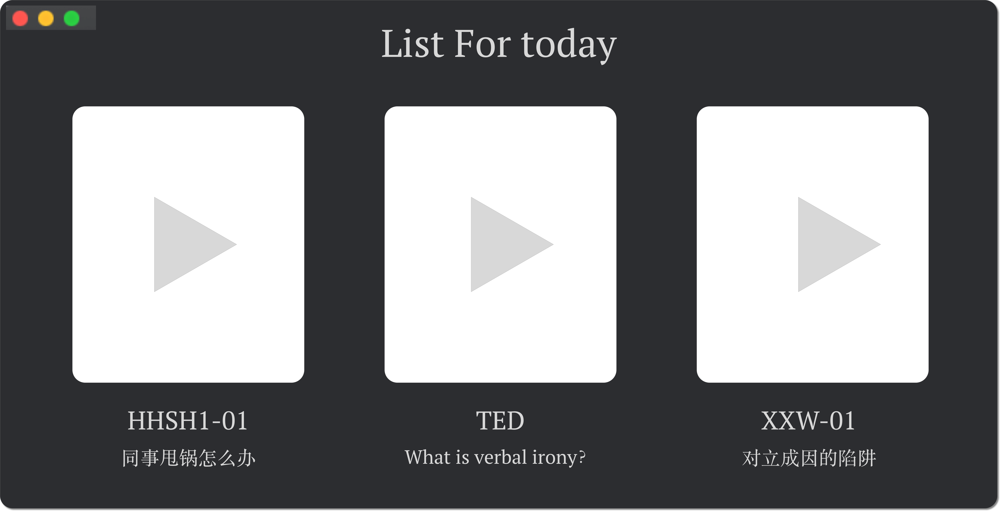

# Dailylist

简单描述：自动化私人Podcast（收音机）

需求：读取一个存放了TED视频（音频）的资源文件夹，按顺序编号

实现每天晚上10点自动推送，并开始播放今天的TED视频（音频）

Optional Feature:（如果今天没有听，将会推迟到下一天，如果今天想多听一个，下一天的内容将会自动更改）

主要目的：拖延症福音

其他用途（那年那天）：每天早晨在图片文件夹中随机抽选一张，早上打开电脑时，会提醒你回顾一张老照片

